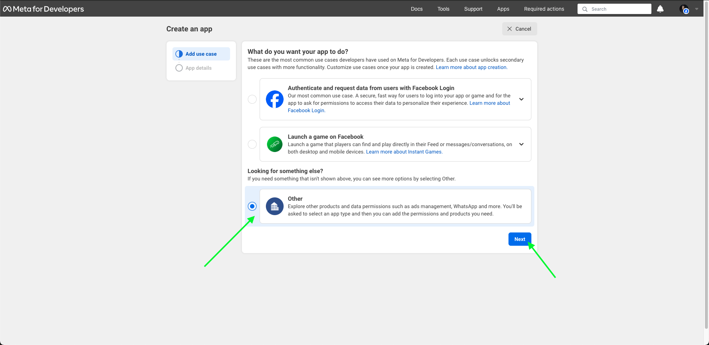

# Zap Bot

This application was made in Node.js + TypeScript, it is a Bot for WhatsApp, which communicates with the official WhatsApp Business API, it simulates a barbershop scheduling flow using mocked data.

## Technologies

- [x] [Node.js](https://nodejs.org)
- [x] [TypeScript](https://www.typescriptlang.org)
- [x] [Fastify](https://fastify.dev)
- [x] [WhatsApp Business API](https://business.whatsapp.com/products/business-platform)
- [x] [PostgreSQL](https://www.postgresql.org)
- [x] [Docker](https://www.docker.com)
- [x] [Docker Compose](https://docs.docker.com/compose)
- [x] [Prisma](https://www.prisma.io)
- [x] [Ngrok](https://ngrok.com)

## Project Architecture


## Preview

https://github.com/Sup3r-Us3r/zap-bot/assets/22561893/cd72450f-1ec8-4a89-9648-6e03660edda4

<details>
<summary>Facebook Developers Setup</summary>

Follow the steps below to configure your application on Facebook Developers.

Go to Facebook Developers here: [link](https://developers.facebook.com)

### Step 1

Access My Apps page


### Step 2

Create a new app


### Step 3

Select what the app does



### Step 4

Select app type


### Step 5

Add app info


### Step 6

Setup WhatsApp


### Step 7

WhatsApp API Setup


This step is important, you must copy the `Temporary access token` and paste it into the `.env` file in the `GRAPH_API_TOKEN` variable, the API Setup documentation will cover environment variables.

You need to select the test number that WhatsApp will generate for you, and you also need to enter your real cell phone number. After that, you must click on `Send message` to have a test message sent on your WhatsApp.

### Step 8

WhatsApp configuration


This step is also very important, in it we need to inform the `Callback URL` and the `Verify token`, this URL will be used for WhatsApp to verify our Webhook.

- **Callback URL**: It is the https URL that will be generated by Ngrok, and `/webhook` is the API endpoint with `GET` method that will be used to verify the Webhook.
- **Verify token**: It is the name of your app

You will only be able to complete this step after setting up the API, so access the documentation below to run the API and make all the necessary settings, and return to this step when finished.


In this step we need to select the `messages` event, this means that when the user sends us a message, WhatsApp will notify us by calling the `/webhook` endpoint with the `POST` method.

</details>

<details>
<summary>Execute application</summary>

## Setup API

### Install dependencies

```sh
$ npm i
```

### Create your `.env`

```sh
$ cp .env.example .env
```

Change these variables to their appropriate value and save the file:

```sh
WEBHOOK_VERIFY_TOKEN="App name"
GRAPH_API_TOKEN="Temporary access token"
```

### Install Ngrok

As we are going to run the project in development mode, we need to use Ngrok to be able to generate an HTTPS link that will expose our local server to the internet, it would be as if our API were published in production, it's just a way to get around this problem, Therefore, the WhatsApp platform will be able to interact with our API locally without having to actually publish it.

It's very simple, you just need to create an account and install [Ngrok](https://ngrok.com), it's free.

## Execute API Server

### Start PostgreSQL

```sh
$ docker-compose up -d
```

### Run migration

```sh
$ npx prisma migrate dev
```

### Run API

```sh
$ npm run dev
```

### Run Ngrok

```sh
$ ngrok http 8080
```

After running the above command, Ngrok will generate an HTTPS URL for you to use. This URL can access the API that is running locally externally.


> 8080 is the server port, if you change this port number you will need to run ngrok with this changed port.

</details>
